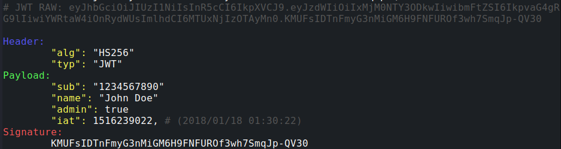

# JWTParser

Esta herramienta en Python permite decodificar un JWT (JSON Web Token) desde la línea de comandos. Muestra el `header`, `payload` y `signature` con colores en la terminal. Los campos `iat` y `exp` son convertidos de formato Unix timestamp a fecha y hora legible. 
Básicamente. Lo mismo que https://jwt.io/ pero desde cli y offline, ideal para hacer evidencias.

## Uso
```bash
python jwtparser.py <JWT>
```


